# Work Orders Web App

A simple .NET Core + Angular app for viewing work orders!

This web app was designed to demonstrate
  - working knowledge of the .NET framework
  - understanding of web development technologies (HTML, CSS, Angular)
  - basic knowledge of back-end processes (CRUD operations)
  - practical implementation of UI/UX design when integrated 
  with data retrieved from a database

## Getting Started

### Table of Contents

1. [Requirements](#requirements)
2. [Setup](#setup)
   - [Installation](#1-installation)
   - [Database](#2-database)
   - [Web App Project](#3-web-app-project-net-core--angular)
3. [Usage](#usage)
    - [Work Orders](#1-work-orders)
         - [*Work Order Detail Page*](#work-order-detail-page)
         - [*New Work Order Form*](#new-work-order-form)
    - [Technicians](#2-technicians)
         - [*Technician Detail Page*](#technician-detail-page)
4. [Notes](#notes)
5. [Credits](#credits)

### Requirements

  - [Windows OS][1]
  - [NPM][2]
  - [Angular CLI][3]
  - Instance of MS SQL Server Express (2016, 2017, 2019*, or 2022 edition)
  - Visual Studio 2019 or higher (Older versions of Visual Studio have not been tested)

>*__*This is the recommended version*__

### Setup

#### __1. Installation__

First, be sure to [install LocalDB][4]. Once that is complete, 
connect to the LocalDB using the following connection string: 
`Server=(LocalDB)\MSSQLLocalDB;Integrated Security=true;AttachDbFileName=<filepath_to_data_file>.mdf` 
where `<filepath_to_data_file>` is the absolute path to your 
main/master database file (.mdf).

#### __2. Database__

Be sure that the database file contains two tables with their 
respective column names and data types as listed below:
- technicians*
  | TechnicianID | TechnicianName | TechnicianEmail|
  |:-: | :-: | :-:|
  |int|nvarchar(30)|nvarchar(50)|
- workorders** 
  | WONum | Email | Status | DateReceived | DateAssigned | DateComplete | ContactName | TechnicianComments | ContactNumber | TechnicianID | Problem |
  | :-: | :-: | :-: | :-: | :-: | :-: | :-: | :-: | :-: | :-: | :-: |
  |int|nvarchar(50)|nvarchar(20)|datetime|datetime|datetime|nvarchar(50)|nvarchar(MAX)|nvarchar(25)|int|nvarchar(MAX)

*__*All fields are required*__\
**__*All fields EXCEPT for WONum are nullable*__

>Note that to get connect to LocalDB successfully, you may need 
to change the `Secrets ID` found under `WorkOrderProject` > 
`Connected Services` > `Secrets.json(Local) `to your 
personalized Secrets ID number

#### __3. Web App Project__ (*.NET CORE + Angular*)

Once the database has been connected and the Secrets.json file 
points to the correct location, 
launch the web app using the green `Start` button in the Ribbon 
or by simply pressing `F5`. 

Two command prompts will open: 
  - one provides you with a localhost URI to route to (if you 
  set up your debugging tools to not open the browser when 
  initiating debugging mode) and provides real-time status logs 
  for the back-end (.NET Core)
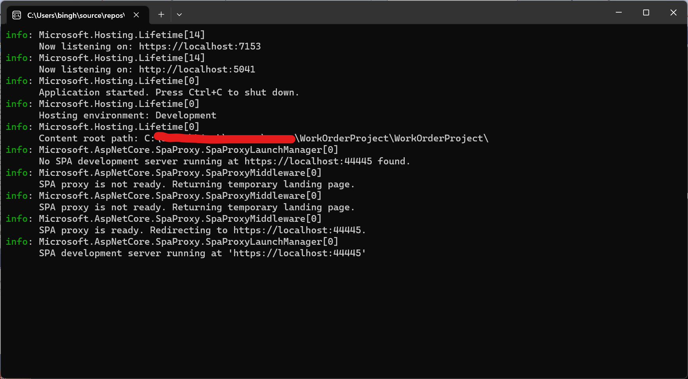
  - the other launches after the back-end prompt to begin 
  building the actual web app view and provide you with crucial 
  information about the web app's status (Angular)
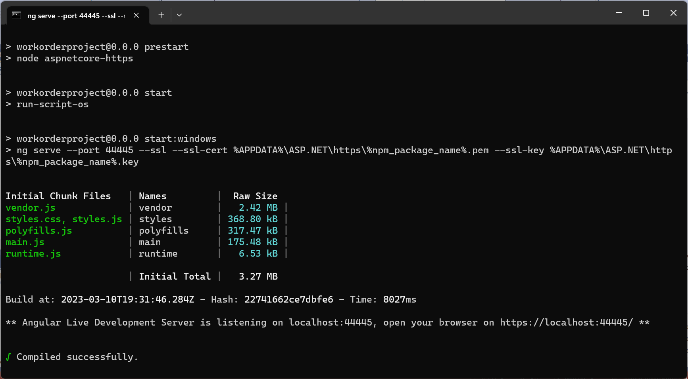

>According to [Microsoft][5], the connection to LocalDB may fail 
with a timeout message. If this is the case, please wait a few 
seconds and then try again.

### Usage

Once you have successfully launched the project, you will be 
able to view and add work orders and get info on the technicians 
as well.

When you first launch the web app, you will see the Welcome page.
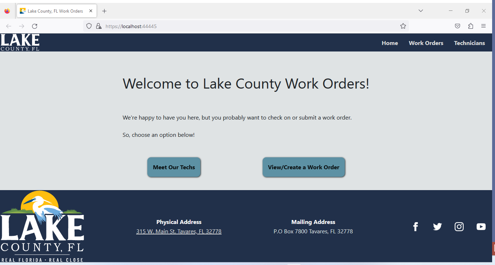

From there you can either choose to review the Technicians list 
under the `Meet Our Techs` button or `Technicians` navigation 
link up at the top or simply look at or add new work orders via 
the `View/Create a Work Order` button or `Work Orders` link.

#### __1. Work Orders__

Choosing the Work Orders option will bring you to the Work 
Orders page. From here, you can add a new order or simply filter 
the pre-existing ones by their status.
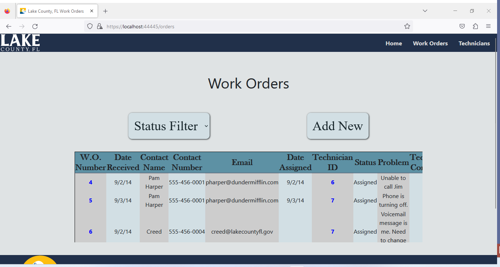

##### *Work Order Detail Page*

Clicking on an order number will bring you to its Detail Page 
where you will be able to get a detailed overview.
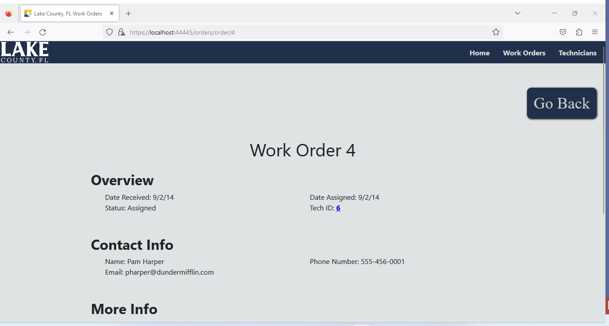

If that particular order is closed, there will be a message at 
the bottom stating as much and providing the closure date.
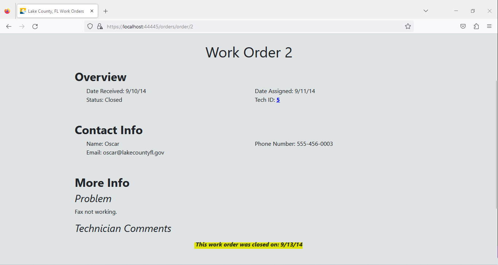

##### *New Work Order Form*

Clicking the `Add New` button on the work orders page opens a 
modal where the user can enter their contact information, 
problem, and even select a technician!
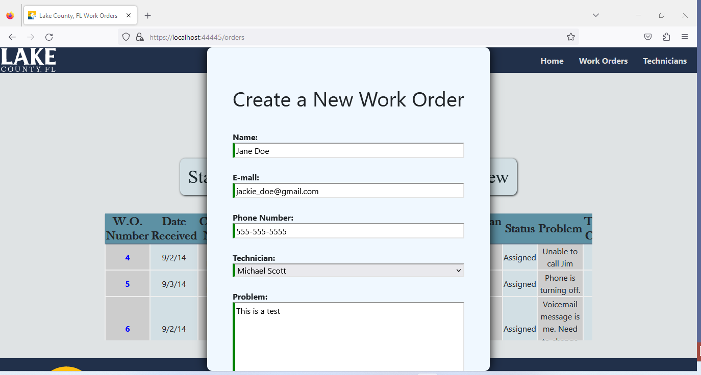
>Note that the fields will indicate that they are valid by 
displaying a green border

\
Once the form is created, a message will appear letting the user 
know the work order was successfully submitted to the database.
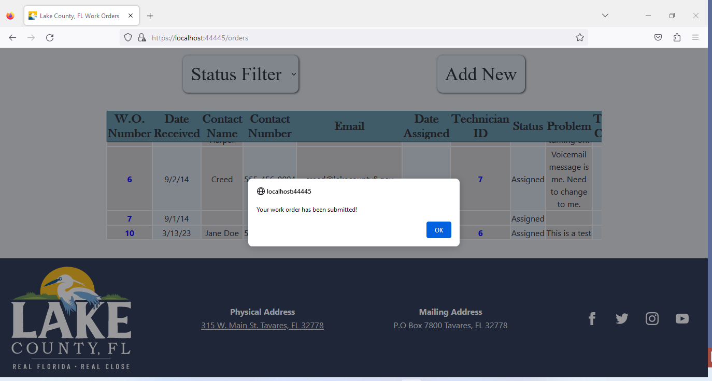

They will then be able to see that result in the order list!
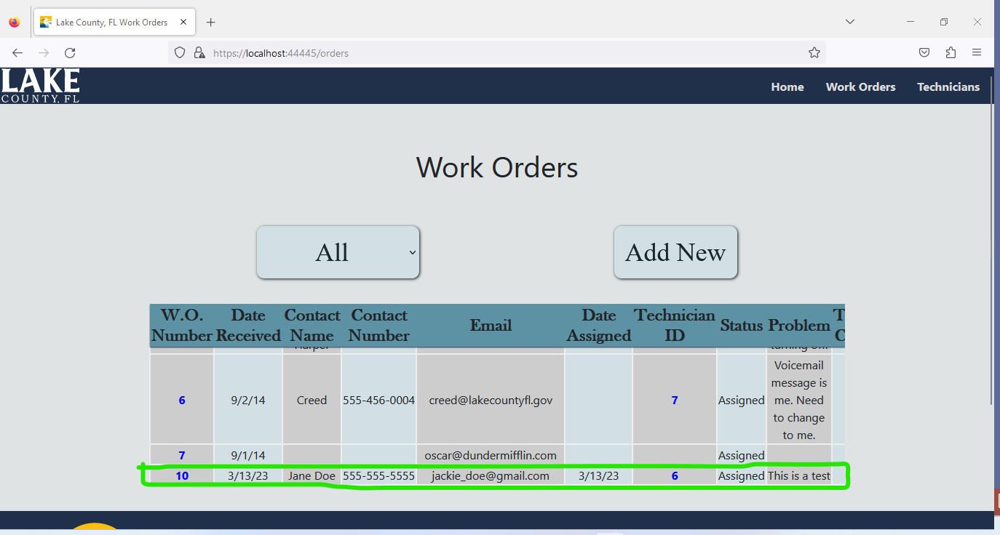

\
If the email or phone number fields are incorrectly formatted, 
a message will appear and the border will turn red. The `Create` 
button will also become inactive until all fields are valid.
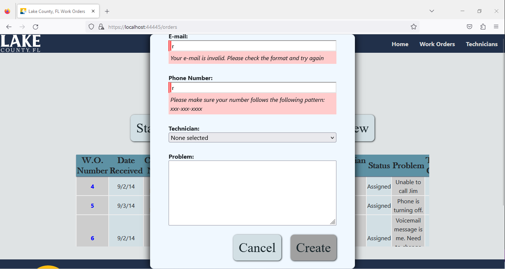

If there is an issue with the submission, the user will get an 
alert prompting them to try again at a later time.
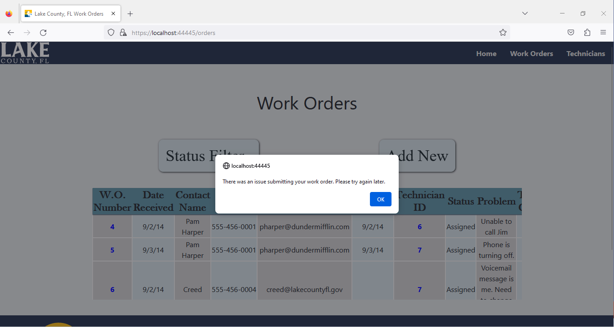

#### __2. Technicians__

Selecting the `Technicians` link will take you to the overview 
page, where you will see all the technicians and their contact 
information.
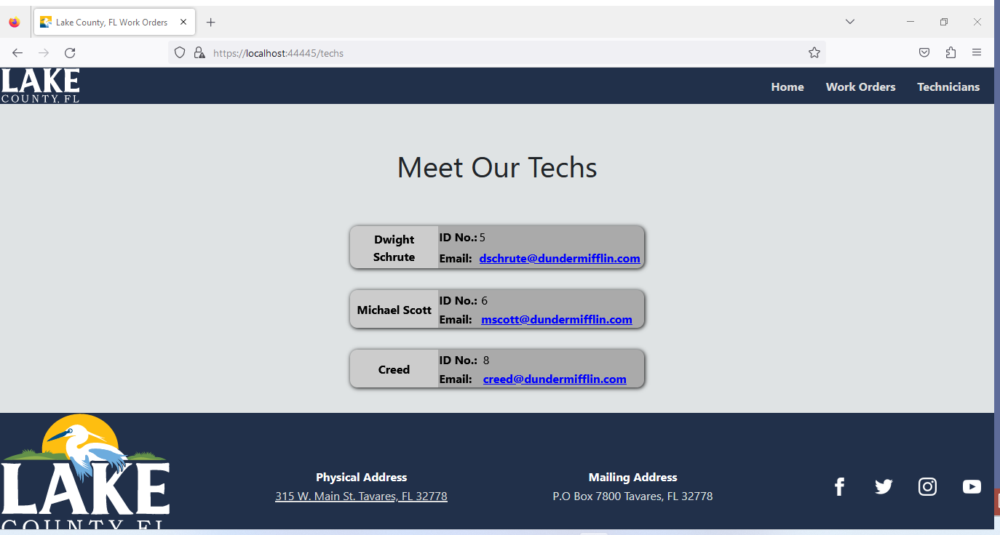

##### *Technician Detail Page*

If you click on one of the tech's contact cards, it will take 
you to their summary page. 

If the technician has been assigned to work orders, the order 
number and status will show towards the bottom of the page.
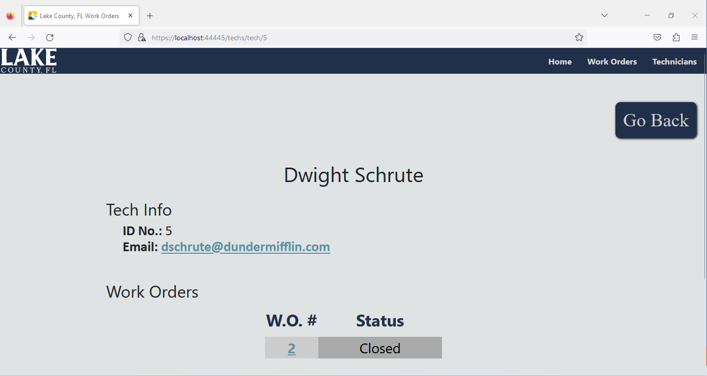

If not, instead of the order list, a message will appear stating 
that this tech has not been assigned any work orders.
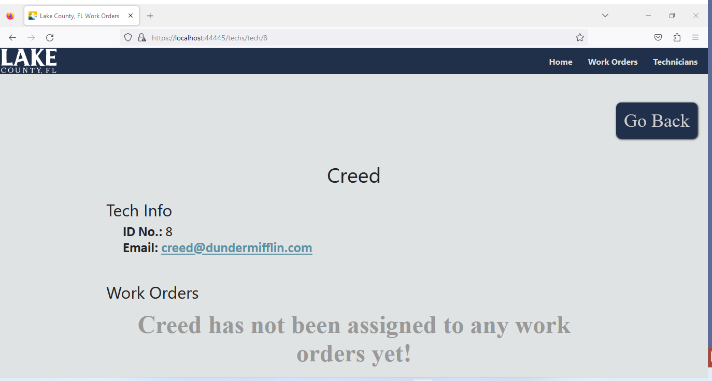

> __NOTE:__ All pages have a similar message if there is no data 
to populate. If a link or manually entered URI brings you to 
either detail page or to some other page, but that resource does 
not exist, users will be shown an Error 404 page.
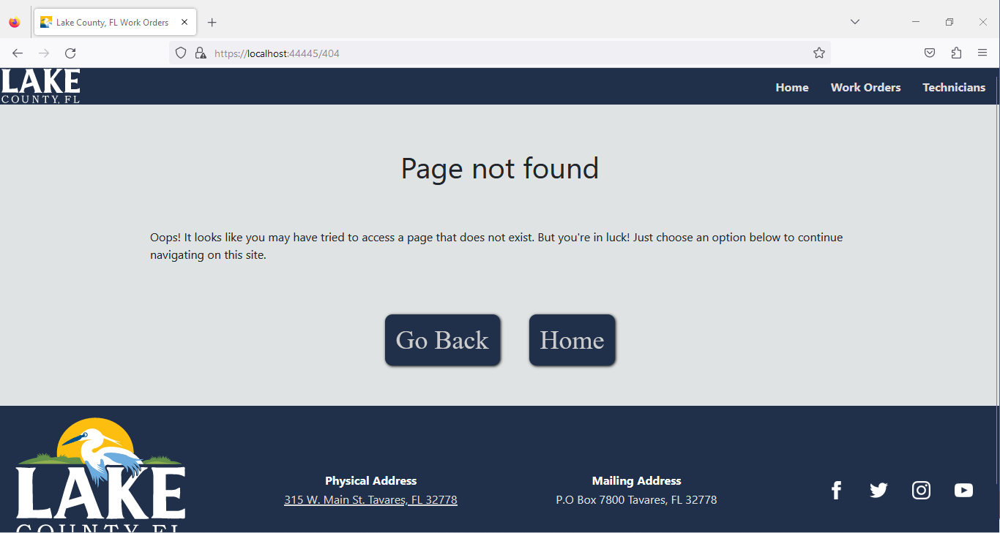

## Notes

__This project is not in production.__

Currently the only CRUD operations supported on the workOrders 
database through this web app are `CREATE` for the `workorders` 
table to perform record insertion, as well as `READ` and 
`DELETE`  for both `workorders` and `technicians`, though the 
`DELETE` method is not currently implemented. 

Future iterations, if created, should include `UPDATE` methods 
for both tables as well as modifications to the `CREATE` method 
for the `technicians` table. 

Concerns for the `DELETE` and `UPDATE` methods include fidelity 
and tracking for auditing or analytic purposes in case of a 
production implementation.

>__NOTE__: Please address fidelity and security issues in 
accordance to your company policy and procedures if this 
solution is used for further development, especially if used 
for production purposes. Adjust code as needed.

## Credits 

The database file used in this project was provided courtesy of 
the __Lake County, FL Communications__ team. Without the code 
test,  I may never have had the opportunity to learn or use 
Angular the way I did for this project. The week and half I 
spent meeting all the requirements, learning, and 
troubleshooting has been fun &mdash; so thank you for that 
opportunity.

The Lake County logos, addresses, and social links were gathered 
from Lake County's [home page](https://www.lakecountyfl.gov/ "Lake County, FL | Real Florida, Real Close").

The social icons were downloaded from [iconmonstr](https://www.google.com/url?sa=t&rct=j&q=&esrc=s&source=web&cd=&cad=rja&uact=8&ved=2ahUKEwiSp-Xqitr9AhWiVTABHTsZAQ8QFnoECAgQAQ&url=https%3A%2F%2Ficonmonstr.com%2F&usg=AOvVaw1VOtp4J_BFSQR6VDj42CeH "iconmonstr - Free simple icons for your next project").

*All other resources used inside this project are mentioned and 
linked inside the comments and documentation within this 
project.*

\
&copy;2023 bingham x solutions

[1]: https://learn.microsoft.com/en-us/sql/database-engine/configure-windows/sql-server-express-localdb?view=sql-server-ver16#restrictions
[2]: https://nodejs.org/en/download/
[3]: https://angular.io/guide/setup-local 
[4]: https://learn.microsoft.com/en-us/sql/database-engine/configure-windows/sql-server-express-localdb?view=sql-server-ver16#installation-media 
[5]: https://learn.microsoft.com/en-us/sql/database-engine/configure-windows/sql-server-express-localdb?view=sql-server-ver16#connect-to-the-automatic-instance
